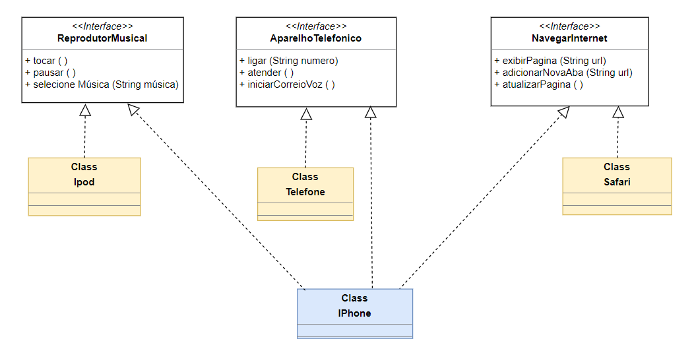

# Orientação a Objetos e UML: Diagramação de Classes do iPhone

Como parte do desafio de projeto do Santander Bootcamp 2023, elaborei um diagrama UML das classes e interfaces com a proposta de representar os papéis do iphone de: Reprodutor Musical, Aparelho Telefônico e Navegador na Internet.

## Em seguida criei as classes e interfaces no formato de arquivos.java

| Arquivo                          | Descrição                                           |
|----------------------------------|-----------------------------------------------------|
| [Iphone](https://github.com/DurezahGeek/)    |Serve como ponto de entrada (método main) para simular as funcionalidades de um dispositivo semelhante a um iPhone.       |
| [AparelhoTelefonico](https://github.com/DurezahGeek/)    | ligar, atender, iniciarCorrerioVoz.   |
| [NavegadorInternet](https://github.com/DurezahGeek/)        | exibirPagina, adicionarNovaAba, atualizarPagina.   |
| [ReprodutorMusica](https://github.com/DurezahGeek/)        | tocar, pausar, selecionarMusica   |

